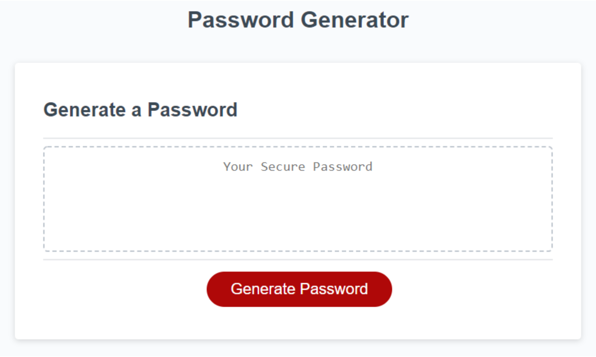

# Password-Generator

<h3>Description</h3>

The purpose of this assignment was to use JavaScript to create a password-generator. The password generator was designed to be used by the user by clicking on the button and being asked to choose between 8 and 128 mixed characters to generate a secure password. Then a series of prompts will generate for the user to allow them to select the most secure or least secure password, with prompts to select lowercase letter, uppercase letters, special characters, or numbers.
 

<h3>Source Type </h3>

JavaScript

<h3>The Website</h3>

Here is the link to the <a href ="https://mcgeevee.github.io/Password-Generator/" >website</a>

<h3>License</h3>

<a href="https://choosealicense.com/licenses/mit/#">MIT</a> License

